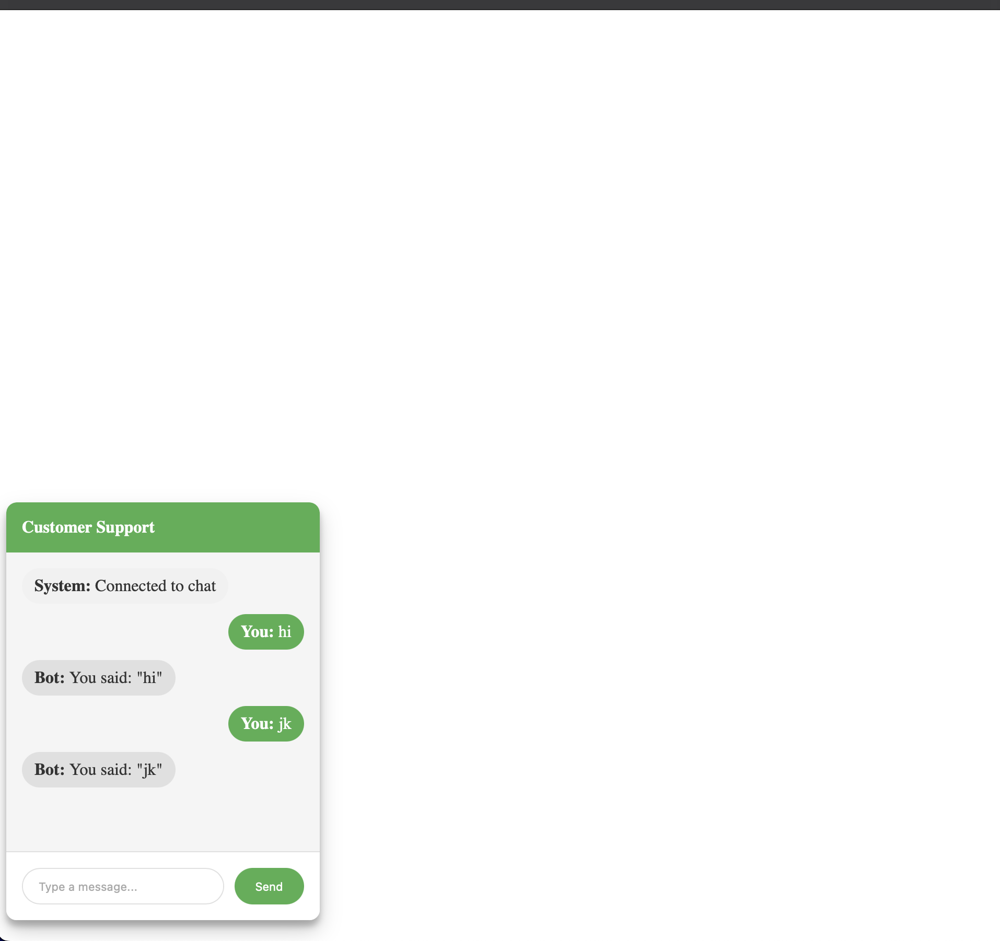

This `README.md` file provides a comprehensive guide on how to use the `ChatWindow` component, including installation, usage, configuration, and an example.

# Run Sample

node server.js  
Open chat.html in a browser



# Chat Window

A simple embeddable chat window component built with JavaScript.

## Description

This project provides a customizable chat window component that can be embedded into any web page. It supports WebSocket connections for real-time messaging.

## Installation

To use the Chat Window component, include the `chat-window.js` file in your project.

```html
<script src="path/to/chat-window.js"></script>
```

## Usage

```javascript
// Create a new ChatWindow instance
const chatWindow = new ChatWindow("chat-container", {
	title: "Support Chat",
	width: "300px",
	height: "400px",
	position: "bottom-right",
	websocketUrl: "ws://localhost:8080",
});
```

The `ChatWindow` class accepts the following options:

-   `title`: The title of the chat window (default: "Chat Window").
-   `width`: The width of the chat window (default: "300px").
-   `height`: The height of the chat window (default: "400px").
-   `position`: The position of the chat window on the screen (default: "bottom-right").
-   `websocketUrl`: The WebSocket URL for real-time messaging (default: "ws://localhost:8080").

```html
<!DOCTYPE html>
<html lang="en">
	<head>
		<meta charset="UTF-8" />
		<meta name="viewport" content="width=device-width, initial-scale=1.0" />
		<title>Chat Window Example</title>
		<script src="path/to/chat-window.js"></script>
	</head>
	<body>
		<div id="chat-container"></div>
		<script>
			// Create a new ChatWindow instance
			const chatWindow = new ChatWindow("chat-container", {
				title: "Support Chat",
				width: "300px",
				height: "400px",
				position: "bottom-right",
				websocketUrl: "ws://localhost:8080",
			});
		</script>
	</body>
</html>
```
